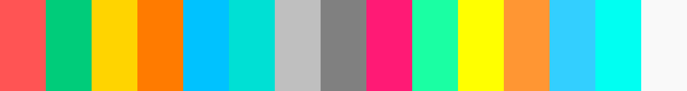

<h1 align="center">
citruszest.nvim

<a href="https://opensource.org/license/mit/" rel="nofollow"></a>
<a href="https://www.lua.org/"></a>
[](https://github.com/zootedb0t/citruszest.nvim/actions/workflows/luacheck.yml)

</h1>

<p align="center">


<b>citruszest.nvim</b> features a combination of bright and juicy colors reminiscent of various citrus fruits. The primary colors include vibrant oranges, zesty yellows, and refreshing greens. These colors are carefully selected to provide a visually stimulating and attention-grabbing experience while coding.

</p>

## :fire: Showcase


## :wrench: Installation

### Requirement

- ***Treesitter*** (Recommended)
- Neovim >= 0.9.1

[lazy.nvim](https://github.com/folke/lazy.nvim)

```lua
{
  "zootedb0t/citruszest.nvim",
  lazy = false,
  priority = 1000,
},
```

[packer.nvim](https://github.com/wbthomason/packer.nvim)

```lua
use { "zootedb0t/citruszest.nvim" }
```

[vim-plug](https://github.com/junegunn/vim-plug)

```viml
Plug 'zootedb0t/citruszest.nvim'
```

## :question: Usage

Enable `colorscheme` after installation.

In `init.lua`

```lua
vim.cmd("colorscheme citruszest")
```

In `init.vim`

```viml
colorscheme citruszest
```

## :hammer: Configration

To find `highlight` group of word under cursor. Use `Inspect` command.

```lua
    -- For using default config leave this empty.
    require("citruszest").setup({
        option = {
            transparent = false, -- Enable/Disable transparency
            bold = false,
            italic = true,
        },
        -- Override default highlight style in this table
        -- E.g If you want to override `Constant` highlight style
        style = {
        -- This will change Constant foreground color and make it bold.
        Constant = { fg = "#FFFFFF", bold = true}
        },
    })
```

`citruszest` supports [lualine.nvim](https://github.com/nvim-lualine/lualine.nvim/).

```lua
local lualine = require 'lualine'

lualine.setup {
  options = {
    theme = 'citruszest',
  }
}
```

## :pushpin: Supported Plugins

- [nvim-cmp](https://github.com/hrsh7th/nvim-cmp)
- [Telescope](https://github.com/nvim-telescope/telescope.nvim)
- [Nvimtree](https://github.com/nvim-tree/nvim-tree.lua)
- [nvim-ts-rainbow2](https://gitlab.com/HiPhish/nvim-ts-rainbow2)
- [fidget.nvim](https://github.com/j-hui/fidget.nvim)
- [gitsigns.nvim](https://github.com/lewis6991/gitsigns.nvim)
- [alpha.nvim](https://github.com/goolord/alpha-nvim)
- [whichkey.nvim](https://github.com/folke/which-key.nvim)
- [flash.nvim](https://github.com/folke/flash.nvim)
- [lazy.nvim](https://github.com/folke/lazy.nvim)

## :fireworks: Integration

- [Kitty](https://github.com/kovidgoyal/kitty) users copy [this](extra/kitty-theme.conf) into their `kitty.conf`.
- `Xresources` is available [here](extra/xresources).
- [Foot](https://codeberg.org/dnkl/foot) terminal users can use [this](extra/foot-terminal).
- [iterm2](https://iterm2.com/) user can use [this](extra/citruszest.itermcolors).

## :art: Colors

| Color          | Value     | Background                                               |
| -------------- | --------- | -------------------------------------------------------- |
| Background     | `#121212` |     |
| Foreground     | `#BFBFBF` |     |
| Visual         | `#404040` |         |
| Cursor         | `#383838` |         |
| Black          | `#232323` |          |
| Red            | `#FF5454` |            |
| Green          | `#00CC7A` |          |
| Yellow         | `#FFD700` |         |
| Orange         | `#FF7431` |         |
| Blue           | `#00BFFF` |         |
| Cyan           | `#48D1CC` |           |
| White          | `#BFBFBF` |          |
| Black(Bright)  | `#767C77` |   |
| Red(Bright)    | `#FF1A75` |     |
| Green(Bright)  | `#1AFFA3` |   |
| Yellow(Bright) | `#FFFF00` |  |
| Orange(Bright) | `#FFAA54` |  |
| Blue(Bright)   | `#28C9FF` |  |
| Cyan(Bright)   | `#09FFF2` |    |
| White(Bright)  | `#F9F9F9` |    |

## :pray: Acknowledgments

- [SpaceCamp](https://github.com/jaredgorski/SpaceCamp) - For inspiring me write my own colorscheme.
- [FluoroMachine.nvim](https://github.com/maxmx03/FluoroMachine.nvim) - For the beautiful colorscheme.
- [catppuccin](https://github.com/catppuccin/nvim) - For describing highlight groups.

<div align="center">
    <h4>
    Made in Neovim with 💕 For Neovim
    </h4>
</div>
